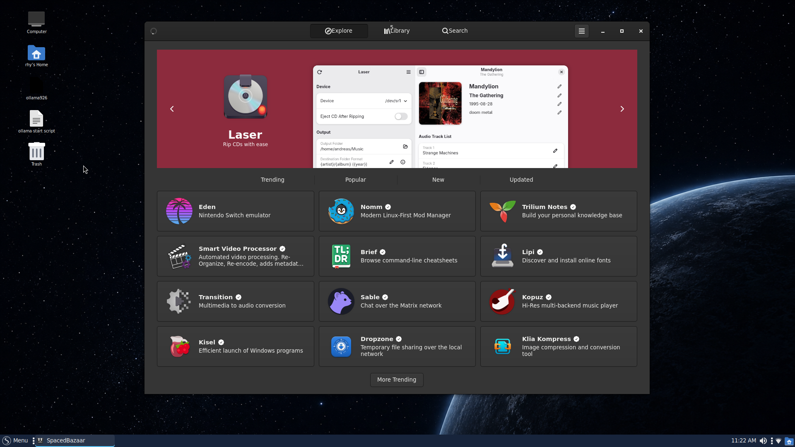

<h1 align="center">

<br/>
SpacedBazaar
</h1>

> [!IMPORTANT]
> This is **space**dbazaar, the [Spaced Linux](https://github.com/crhy/spaced)
> fork of Bazaar. It tracks upstream `main` and carries Spaced Linux-specific
> fixes that upstream has not yet merged. Current delta:
> - `Install apps for the current user`: normal installs go directly to the
>   user installation and no longer show a redundant “this user / all users”
>   chooser. System-installation
>   installs driven from inside the sandboxed app fail after the download with
>   "Path does not exist" ([bazaar-org/bazaar#1298](https://github.com/bazaar-org/bazaar/issues/1298),
>   Spaced Linux issue #61),
>   while user-installation installs work. Existing system installs remain
>   visible and removable.
> - `Independent Flatpak identity`: `io.github.crhy.SpacedBazaar` can be
>   installed alongside the original Bazaar without replacing or launching it.
> - `SpacedBazaar.svg` icon: the app store's brand in the Spaced Linux colors.
> - `Portable Flatpak access`: the bundle uses the standard XDG data mount and
>   contains no account-specific home-directory paths.
>   Releases ship as x86_64 Flatpak bundles on the
>   [releases page](https://github.com/crhy/spacedbazaar/releases).
> - `Verified Spaced apps`: a normalized CRHY release catalog and signed,
>   AppStream-capable `spaced-github` Flatpak repository make Spaced Linux apps
>   searchable, installable, and updateable without treating arbitrary GitHub
>   uploads as trusted software.

> [!NOTE]
> If you are a distributor/packager who would like to learn how to customize
> Bazaar, take a look at the [docs](/docs/overview.md).

> [!NOTE]
> If you are interested in contributing code to Bazaar (Thank you!), please see
> the [contributing guide](/CONTRIBUTING.md).

> [!NOTE]
> If you are interested in contributing translations to Bazaar (Thank you!),
> please see the [Damned Lies Module](https://l10n.gnome.org/module/bazaar/).

SpacedBazaar is an app store for Linux with a focus on discovering and installing
apps and add-ons from Flatpak remotes, particularly
[Flathub](https://flathub.org/). The UX emphasizes supporting the developers who
make the Linux desktop possible. SpacedBazaar features a "curated" tab that can be
configured by distributors.

SpacedBazaar implements the GNOME Shell search-provider D-Bus interface. A KRunner
[plugin](https://github.com/bazaar-org/krunner-bazaar) is available for use on
the KDE Plasma desktop.

Thanks to [Tobias Bernard](https://tobiasbernard.com/), [Jakub
Steiner](http://jimmac.eu), and [Sam Hewitt](https://snwh.org) for designing
Bazaar's market stall icon.

### Screenshots



<br/>


<br/>


<br/>


### Installing

Download the bundle for your architecture from the
[latest GitHub release](https://github.com/crhy/spacedbazaar/releases/latest),
then install it for your user:

```sh
flatpak install --user ./SpacedBazaar-x86_64.flatpak
```

The release is not
the Flathub Bazaar package: it has its own ID and may be installed alongside it.

### Spaced GitHub application catalog

The `spaced-github` remote is preferred when the same application is available
there and on Flathub. Flathub remains configured for runtimes and its broader
catalog. After the signed repository is deployed, add it for the current user:

```sh
scripts/configure-spaced-github-remote.sh --user
```

Repository construction validates the selected stable or explicitly pinned release, SHA-256
digest, bundle identity, architecture, branch, runtime, AppStream metadata, and
a non-empty application icon before import. The catalog includes every released
CRHY desktop Flatpak, including SpacedBazaar and Spaced Welcome. Arbitrary
GitHub assets are never installed automatically. See
[the repository, trust, signing, and maintenance documentation](docs/spaced-github.md).

[](https://github.com/crhy/spacedbazaar/actions/workflows/build-flatpak.yml)

### Supporting

Community help: [Discord](https://discord.gg/BMW9Y6NB3y) · [Telegram](https://t.me/+pjmFzHo-i9A2ZWY5)

You can support Spaced Linux development at
[spacedlinux.com](https://spacedlinux.com/#donate).

#### Code of Conduct

SpacedLinux Code of Conduct:
All facets of Spaced Linux are Free.  You can say and call anyone whatever you want.  We endorse absolute freedom of speech, including screaming fire in a theater.

### Reviewed releases and screenshots

The signed GitHub catalog covers all seven crhy applications with published
Flatpak bundles, including rhYciv. Other crhy projects have no installable
Flatpak release and are not advertised as installable applications.

Ordinary entries follow the latest stable release. A reviewed release pin
names an exact GitHub tag and a SHA-256 for every architecture, allowing the
approved Welcome, Update, and Bazaar testing releases without accepting an
arbitrary prerelease. Drafts, changed pinned assets, mismatched identities,
and unsigned publication remain rejected. Review or remove the pins when
promoting the next stable application releases. This app catalog does not
switch the operating system's APT release channel.

Each published app has a reviewed PNG screenshot with a SHA-256. The
publisher verifies and hosts those images alongside the repository, inserts
them into both AppStream generations, signs the metadata commits, and then
refreshes the signed summary. Imported application commits and verified
GitHub bundle bytes remain unchanged.
